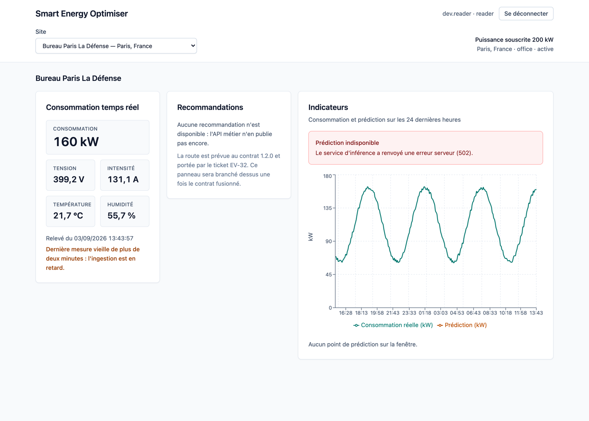
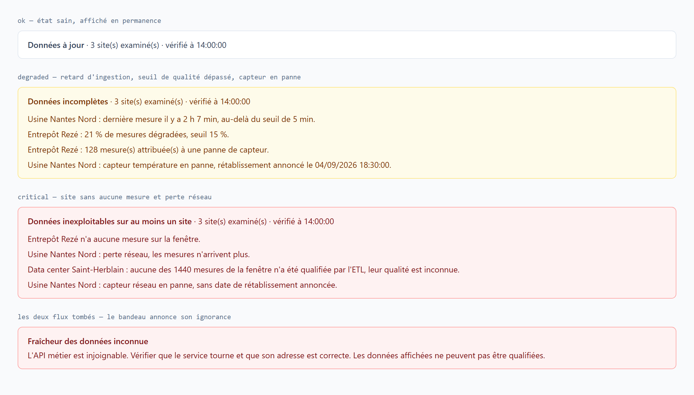
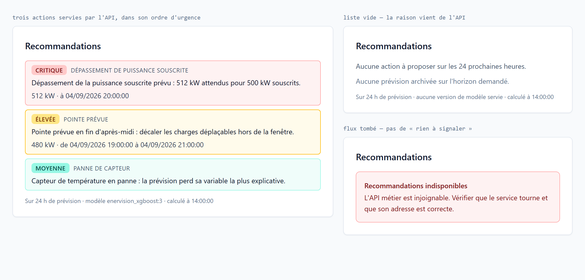
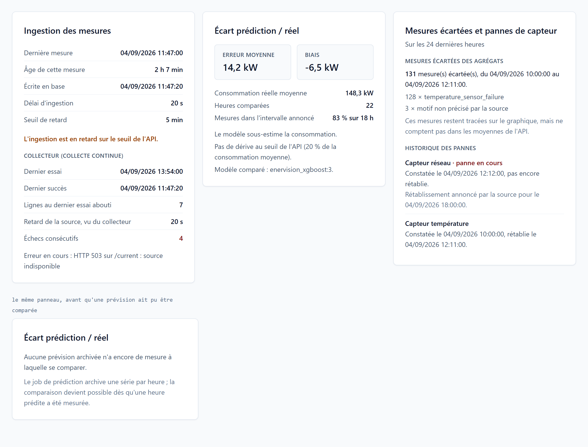

# dashboard

[](https://github.com/EnerVision-G5/dashboard/actions/workflows/ci.yml)

Dashboard web EnerVision (React + Vite + Recharts, ADR-008).

L'écran livré par **EV-16** permet à un client pilote de choisir un site et de
lire, sur un même graphique, sa **consommation réelle** des 24 dernières heures
et sa **prédiction** sur les 24 heures suivantes.

**EV-48** y ajoute l'authentification : une page de connexion garde l'entrée, le
jeton obtenu signe tous les appels, et le dashboard est mis en page d'après la
maquette « Smart Energy Optimiser » — consommation temps réel, recommandations,
indicateurs. **EV-50** réunit les écrans authentifiés derrière une barre de
navigation commune, voir [Navigation](#navigation).

**EV-18** y ajoute un bandeau qui qualifie les données affichées — fraîcheur de
l'ingestion, part de mesures dégradées, état des capteurs — pour qu'aucune
décision ne soit prise sur des données incomplètes sans le savoir. Voir
[Bandeau de fraîcheur et de qualité des données](#bandeau-de-fraîcheur-et-de-qualité-des-données).

Le dashboard ne parle qu'à **l'API métier EnerVision** : sites, mesures,
indicateurs, recommandations et prédictions, ces dernières archivées par un job
de l'API et relues par `GET /api/v1/sites/{site_id}/predictions`. **Il n'appelle
jamais le service d'inférence ni l'API Mock IoT directement.**

## Design system

L'interface repose sur un design system minimal (**EV-47**), dont la note de
conception — validée avant écriture du code — vit dans le repo `enervision`
sous `Architecture/EnerVision-Design-System.docx`.

Son principe tient en une phrase : *un écran de supervision affiche trois
natures de valeur — ce qui a été **mesuré**, ce qui a été **calculé**, et ce
qu'on **ignore** — et le système a une obligation, qu'on ne puisse jamais les
confondre.*

| | Emplacement |
| --- | --- |
| Jetons (couleur, typographie, rayon, élévation) | `src/index.css`, dans `@theme` |
| Composants (`Button`, `Card`, `Field`, `MetricTile`, `Alert`, les quatre états) | `src/ui/` |
| Page de démonstration, **développement seulement** | [`/design-system`](http://localhost:5173/design-system) |
| Mode d'emploi complet | [`docs/design-system.md`](docs/design-system.md) |

La page de démonstration n'existe pas dans le bundle de production — son
import est enfermé dans `import.meta.env.DEV`, que Vite remplace par une
constante au build ; un test le vérifie en forçant `DEV` à `false`.



## Prérequis

- **Node 24** (version utilisée par la CI ; `jsdom` exige au minimum Node 22.22
  ou 24.15).
- Une API métier joignable. La prédiction réelle suppose que son job de
  prédiction ait archivé des résultats, voir
  [Mode JSON de démonstration](#mode-json-de-démonstration) sinon.

## Installation et commandes

```bash
npm ci
```

| Commande            | Rôle                                               |
| ------------------- | -------------------------------------------------- |
| `npm run dev`       | Serveur de développement sur http://localhost:5173 |
| `npm test`          | Tests Vitest + Testing Library (une seule passe)   |
| `npm run lint`      | ESLint                                             |
| `npm run build`     | Vérification TypeScript puis build de production   |
| `npm run gen:types` | Régénère `src/types` depuis les contrats OpenAPI   |

La CI (`.github/workflows/ci.yml`) enchaîne `npm ci`, `npm run lint`,
`npm test` et `npm run build` à chaque push et sur chaque pull request. Le job
de tests appelle `npm test` sans `--if-present` : une suite absente fait
désormais échouer la CI au lieu de la laisser verte à tort.

## Configuration

Copier `.env.example` en `.env` (ou `.env.local`, ignoré par git) et adapter.

| Variable                        | Rôle                                                     | Défaut      |
| ------------------------------- | -------------------------------------------------------- | ----------- |
| `VITE_API_BASE_URL`             | Base de l'API métier, seul service appelé               | **requise** |
| `VITE_PREDICTION_SOURCE`        | `api` (prédictions archivées par l'API) ou `fixture` (JSON de démonstration) | `api` |
| `VITE_DEV_PROXY_API_TARGET`     | Cible du proxy de dev pour `/proxy/api` (facultatif)     | —           |

Aucune de ces valeurs n'est un secret : ce sont des adresses de service. Le
jeton, lui, n'est jamais configuré — il est obtenu à la connexion et vit en
mémoire, voir [Authentification](#authentification).

### En image : la configuration est lue au démarrage

Vite fige les variables `VITE_*` dans le bundle **au build**. L'image est
pourtant construite une seule fois par commit, épinglée par SHA, puis déployée
telle quelle sur des environnements dont les domaines diffèrent : les figer au
build imposerait une image par environnement.

Le conteneur lit donc sa configuration à son démarrage, comme le font déjà
`api` et `predict` :

| Variable du conteneur | Remplace |
| --- | --- |
| `API_BASE_URL` | `VITE_API_BASE_URL` |
| `PREDICTION_SOURCE` | `VITE_PREDICTION_SOURCE` |
| `CSP_CONNECT_SRC` | — (origines de la CSP, voir [Sécurité](#sécurité)) |

```
config.js.template ──envsubst au démarrage──> /etc/nginx/config.js
                                                      │
index.html : <script src="/config.js">  ◄─────────────┘  servi par Nginx
src/config/env.ts : window.__ENERVISION_CONFIG__ ?? import.meta.env
```

L'ordre compte : en image la configuration injectée l'emporte ; en
développement elle n'existe pas et le `.env` reprend la main sans qu'on ait à
le dire. Une adresse absente des deux côtés donne une erreur de configuration
nommant la variable, jamais un appel vers un hôte deviné.

`/config.js` est servi en `no-cache` et **ne doit jamais porter de secret** :
il part en clair à quiconque ouvre la page.

Une base absente n'est pas remplacée par une valeur devinée : l'écran affiche
une erreur de configuration nommant la variable manquante.

### Une seule API

Le contrat gelé publie deux spécifications (`openapi-api.json` et
`openapi-predict.json`), mais le dashboard n'en consomme qu'une : `api.d.ts`
est généré depuis `openapi-api.json` seul. Le service d'inférence n'est appelé
que par l'API métier, dont un job planifié archive les prédictions que le
dashboard relit. Une seule base à configurer, une seule origine à autoriser
dans la CSP.

### Proxy de développement et CORS

L'API métier publie ses en-têtes `Access-Control-*` sur les seules origines
listées dans sa variable `CORS_ALLOWED_ORIGINS`. Tant qu'elle n'y connaît pas
`http://localhost:5173`, sa réponse est bloquée par le navigateur. Deux voies
pour une recette locale — soit renseigner cette variable côté API, soit faire
passer les appels par l'origine de Vite, ce qui évite complètement le
cross-origin :

```bash
VITE_API_BASE_URL=/proxy/api
VITE_DEV_PROXY_API_TARGET=http://localhost:8080
```

Ce proxy ne concerne que `npm run dev` : l'image de production est servie par
Nginx, qui ne proxifie rien. En production, les appels sont donc bel et bien
cross-origin, et les deux côtés doivent se déclarer mutuellement —
`CSP_CONNECT_SRC` côté dashboard, `CORS_ALLOWED_ORIGINS` côté API, voir
[Sécurité](#sécurité).

## Authentification

Flux OAuth2 mot de passe (ADR-009). L'écran de connexion poste les identifiants
en `application/x-www-form-urlencoded` sur `POST /api/v1/auth/token`, et le
jeton obtenu signe ensuite chaque appel en `Authorization: Bearer`.

```
POST /api/v1/auth/token          → { access_token, token_type, expires_in }
                                 ↓
             jeton en mémoire (src/auth/session.ts)
                                 ↓
    intercepteur Axios (src/api/clients.ts) → Authorization: Bearer …
```

Comptes de développement : `dev.reader` / `changeme-dev`, issus du seed
`enervision-db/dev-seed/dev_users.py` du repo **infra**, à appliquer
explicitement. En local, `AUTH_ENABLED=false` côté API permet aussi de
travailler sans jeton — mais l'écran de connexion reste alors affiché, le
dashboard n'ayant aucun moyen de savoir que l'API est en mode anonyme.

### Où vit le jeton

Dans **`sessionStorage`**, sous la clé `enervision.auth.token`, et nulle part
ailleurs. Jamais dans `localStorage`, jamais dans un cookie.

| | Refresh | Nouvel onglet | Onglet fermé |
| --- | --- | --- | --- |
| Session conservée | oui | non | non |

Le choix est un compromis, documenté en détail dans
[`docs/EV-48-securite.md`](docs/EV-48-securite.md) :

- un **cookie `httpOnly`** serait hors d'atteinte de tout JavaScript, donc le
  meilleur choix sur le fond. Il est écarté faute de moyen : l'API délivre le
  jeton dans un corps JSON et ne pose aucun cookie. L'y amener demande une PR
  de contrat ;
- **`localStorage`** survivrait à la fermeture de l'onglet et serait partagé
  entre onglets — précisément ce que l'OWASP déconseille pour un jeton ;
- **`sessionStorage`** garde la session au rafraîchissement, meurt avec
  l'onglet et n'est pas partagé.

> Le guide d'intégration front demandait le jeton « en mémoire, pas en
> localStorage ». `sessionStorage` s'en écarte volontairement, pour l'usage, et
> la contrepartie est la **CSP** posée dans `nginx.conf` : c'est elle qui
> empêche un script injecté d'être chargé, donc de lire le stockage. Le guide
> est à amender en conséquence.

Un jeton stocké n'est jamais accordé sur parole : au chargement, il repasse par
le même contrôle que celui délivré par l'API, échéance comprise. Un jeton échu
ou trafiqué est effacé du stockage plutôt que porté sur des appels qui
reviendraient tous en 401. Ce contrôle reste du confort — la signature est
vérifiée par l'API, seule autorité.

### Fin de session

Trois chemins la ferment, tous vers l'écran de connexion :

- **déconnexion explicite**, par le bouton de l'en-tête ;
- **échéance du jeton**, lue dans sa revendication `exp`, 30 secondes avant
  l'heure pour qu'une requête déjà partie ne revienne pas en 401 ;
- **401 renvoyé par l'API**, quelle que soit la route : l'intercepteur de
  réponse ferme la session sans qu'aucun écran ait à le décider.

**Pas de rafraîchissement silencieux.** Le contrat gelé 1.0.0 ne publie que le
flux mot de passe, sans `refresh_token` : redemander un jeton exigerait de garder
le mot de passe en mémoire toute la session, ce qui coûte plus cher que la
reconnexion évitée. Le jour où le contrat publiera un flux de rafraîchissement,
seul le minuteur de `src/auth/AuthProvider.tsx` changera.

### Ce que la garde de route protège

`RequireAuth` empêche d'**afficher** un écran qui ne pourrait que se remplir
d'erreurs. Elle ne protège aucune donnée : c'est l'API qui refuse en 401 une
requête sans jeton valide, et elle seule fait autorité. Le durcissement complet
des routes est le périmètre d'**EV-49**.

Le rôle (`reader` ou `writer`) est lu dans le jeton, le contrat ne publiant
aucun endpoint de profil. La signature n'est pas vérifiée côté navigateur et ne
peut pas l'être : la clé HS256 est le secret de l'API. Ce décodage sert à
l'affichage et à l'échéance, jamais à autoriser quoi que ce soit.

## Navigation

**EV-50** pose une barre de navigation commune à tous les écrans authentifiés.
Elle porte l'identité du produit, les destinations, l'utilisateur connecté et la
déconnexion — un seul endroit, pour qu'un second écran n'apporte pas une
deuxième barre.

| Destination | Adresse | État |
| --- | --- | --- |
| Dashboard | `/` | Servie |
| Configuration | `/config` | Coquille, contenu attendu par EV-55 |

La page affichée est signalée de trois façons : par le poids du texte, par un
fond, et par `aria-current="page"` — le seul repère qu'un lecteur d'écran
puisse annoncer. La couleur ne porte jamais seule cette information, le design
system l'interdit.

Le lien vers le dashboard exige une correspondance **exacte** (`end`) : servi
sur `/`, préfixe de toute autre adresse, il resterait sinon actif sur la page
de configuration.

La garde de session et la barre sont portées par une route parente,
`AuthenticatedLayout` : un écran ajouté sous elle hérite des deux sans rien
déclarer, et ne peut donc pas être oublié hors authentification. Le
durcissement complet, rôles compris, reste le périmètre d'**EV-49**.

La page `/config` est servie dès maintenant, mais **n'affiche aucun
paramètre**. Un lien de navigation qui retomberait sur la règle `*` ramènerait
au dashboard sans rien dire, ce qui se lit comme une panne ; à l'inverse, un
formulaire posé là aujourd'hui promettrait une persistance que le contrat gelé
1.1.0 ne publie pas. L'écran dit donc ce qu'il en est et renvoie à **EV-55**.

## Écran de supervision

La mise en page suit la maquette « Smart Energy Optimiser » : sous la barre de
navigation, un en-tête portant le sélecteur de site et — à droite — la puissance
souscrite et la localisation du site choisi, puis trois zones.

| Zone | Source | État |
| --- | --- | --- |
| Fraîcheur et qualité | `GET /indicators` et `GET /sites/{id}/sensors`, rafraîchis toutes les 60 s | Servie |
| Consommation temps réel | `GET /sites/{id}/readings/latest`, rafraîchi toutes les 30 s | Servie |
| Recommandations | `GET /sites/{id}/recommendations`, rafraîchi toutes les 5 min | Servie |
| Alertes actives | `GET /alerts`, rafraîchi toutes les 30 s | Servie |
| Indicateurs | graphique consommation / prédiction d'EV-16 | Servi |
| Diagnostics du site | `GET /sites/{id}/indicators` et `GET /sites/{id}/sensors/history`, rafraîchis toutes les 60 s | Servis |
| Actions d'exploitation | `POST /simulations/spike/{id}` et `POST /sites/sync`, sur demande | Servies, **rôle `writer`** |
| Historique des pics | `GET /simulations/spike`, relu après chaque déclenchement | Servi |
| Modèles | `GET /models` et `GET /models/current` | Servis |

### Bandeau de fraîcheur et de qualité des données

**EV-18** pose au-dessus des trois zones un bandeau qui qualifie ce qu'elles
affichent. Il répond à une question simple : *puis-je décider sur la base de ce
que je vois ?*

| Source | Portée |
| --- | --- |
| `GET /indicators?window_hours=24` | les sept sites, en une requête |
| `GET /sites/{id}/sensors` | le site affiché seulement |

Le contrat **1.5.0** a rendu ce ticket possible. Il publie non seulement les
indicateurs, mais **le seuil qui qualifie chacun d'eux** —
`stale_threshold_seconds` pour la fraîcheur, `threshold` pour la part dégradée
— ainsi que les verdicts `is_stale`, `exceeds_threshold` et la synthèse
`overall` des capteurs. Le dashboard les relit ; **il ne choisit aucun seuil**,
sans quoi un seuil révisé côté exploitation devrait être suivi à deux endroits.



Trois niveaux, dans le vocabulaire du contrat :

| Niveau | Ce qui le déclenche | Traitement |
| --- | --- | --- |
| `ok` | aucun constat | ligne sobre, sans rôle vivant : rien à annoncer |
| `degraded` | retard d'ingestion, part dégradée au-delà du seuil, fenêtre non qualifiée, panne de capteur | famille « estimation », `role="status"` |
| `critical` | site sans aucune mesure, perte réseau | famille « alerte », `role="alert"` |

Quatre décisions valent d'être expliquées.

**Le bandeau est affiché en permanence**, pas seulement en cas d'incident. Un
bandeau qui n'apparaît qu'en cas de problème est indiscernable d'un bandeau en
panne : rien à l'écran ne dirait alors si les données sont saines ou si la
vérification a échoué. L'état sain porte donc l'heure du dernier calcul servi
par l'API.

**Un site muet n'est pas un site en retard.** Le contrat les distingue par
`last_measure_at`, et le second est moins grave que le premier : un site qui ne
mesure plus rien est `critical`, un site en retard est `degraded`.

**Une fenêtre non qualifiée n'est pas une fenêtre saine.** `data_quality` vaut
`good` par défaut : une fenêtre que l'ETL n'a pas encore traitée affiche donc
0 % de dégradation sans rien valoir. `qualified_ratio` le dit, et le bandeau le
signale plutôt que de présenter le site comme propre — c'est précisément ce que
le ticket cherche à empêcher.

**Les deux flux échouent indépendamment.** Des capteurs indisponibles
n'effacent pas une fraîcheur correctement lue, et le flux manquant est nommé.
Quand les deux tombent, le bandeau annonce son ignorance : il ne dit jamais que
tout va bien faute d'avoir pu vérifier.

Le bandeau est rafraîchi toutes les 60 secondes. Ce n'est pas un ornement : la
fraîcheur se dégrade toute seule, et un bandeau figé finirait par affirmer que
les données sont à jour dix minutes après la chute de l'ingestion.

**Limite connue :** l'état des capteurs n'est lu que pour le site affiché, le
contrat ne publiant pas de route capteurs pour le parc. Sept requêtes en
parallèle à chaque rafraîchissement coûteraient plus que ce que le bandeau en
tirerait ; le besoin est remonté plutôt que contourné. La fraîcheur et la
qualité, elles, couvrent bien les sept sites.

**Consommation temps réel** affiche la puissance instantanée, puis la tension,
l'intensité, la température et l'humidité — toutes issues de la même
`EnergyReadingOut`. Une valeur `null` y est affichée comme absente (`—`), jamais
comme un zéro, et la valeur imputée par l'ETL n'est jamais substituée au relevé :
elle est mentionnée pour ce qu'elle est. Une mesure vieille de plus de deux
minutes signale un retard d'ingestion — **au seuil de l'API**, depuis EV-52 :
le panneau reçoit le `stale_threshold_seconds` du contrat et n'utilise le seuil
du guide d'intégration, écrit dans `src/api/readings.ts`, que s'il n'en reçoit
aucun. Deux seuils différents sur le même écran, l'un ici et l'autre dans le
bandeau, auraient fini par se contredire.

Une mesure **écartée des agrégats** (`excluded`) y est signalée avec son motif,
sans être cachée : elle reste affichée telle qu'elle a été relevée, mais on sait
qu'elle ne compte pas dans les moyennes de l'API.

**Recommandations** est branché sur l'API depuis **EV-54** :
`GET /sites/{id}/recommendations` propose des actions calculées à partir des
prévisions du modèle. Le dashboard n'en formule aucune et n'en reclasse
aucune — voir [Recommandations](#recommandations).

### Recommandations

**EV-54** branche la zone Recommandations sur
`GET /sites/{id}/recommendations`, que l'API calcule **à la demande** depuis les
prévisions archivées du site — le contrat le précise : « rien n'est archivé ».
La zone tenait sa place sans rien afficher depuis EV-48 ; les conseils qu'elle
présente maintenant viennent tous du service.



Quatre règles tiennent ce panneau :

- **le dashboard ne conseille rien.** `message` est décrit au contrat comme une
  « formulation prête à afficher » : elle n'est ni reformulée, ni tronquée, ni
  complétée. Les trois natures d'action du contrat — `predicted_peak`,
  `capacity_overrun`, `sensor_failure` — sont seulement traduites en français ;
- **l'ordre est celui de l'API.** `items` arrive « de la plus urgente à la moins
  urgente ». Retrier la liste ici reviendrait à substituer notre jugement à
  celui du service qui a vu les chiffres ;
- **la sévérité n'est jamais portée par la seule couleur.** Chaque action
  affiche son niveau écrit — faible, moyenne, élevée, critique — comme les
  bandeaux du design system ;
- **une liste vide est expliquée par l'API.** Le contrat sert un champ `detail`
  dont la description est sans ambiguïté : « raison d'une liste vide ». Le
  panneau l'affiche, parce que « aucun risque détecté » et « aucune prévision à
  examiner » ne se valent pas, et que seul le service sait lequel des deux
  s'applique. Une erreur d'appel, elle, n'est jamais présentée comme une
  absence de conseil.

La provenance est affichée sous la liste : horizon examiné, heure du calcul et
**version du modèle**. Le contrat le justifie mieux que ce README ne le
ferait — « un conseil ne vaut que ce que vaut le modèle qui le fonde » — et son
absence est signalée plutôt que passée sous silence.

Le rafraîchissement est de **cinq minutes**, et non de trente secondes comme
les mesures : les recommandations découlent des prévisions, qu'un job recalcule
toutes les heures. Interroger plus souvent relirait le même raisonnement sur
les mêmes prévisions.

### Alertes actives

**EV-17** affiche les alertes du site à côté des recommandations. Les deux
partagent la même échelle de gravité — à dessein, dit le contrat — mais pas la
même liste : une alerte **constate ce qui vient de se produire**, une
recommandation **propose une action sur ce qui va se produire**. Les mêler
obligerait le lecteur à distinguer, à chaque ligne, ce qu'il doit croire de ce
qu'il doit faire.

Deux propriétés de la route commandent l'affichage :

- **le tri est fait côté écran.** `GET /alerts` sert un journal, du plus récent
  au plus ancien : c'est l'ordre d'un historique, pas celui d'une liste
  d'incidents à traiter. Le ticket demande un tri par gravité, et
  `sortBySeverity` s'en charge — à gravité égale, la plus récente passe devant.
  C'est l'inverse des recommandations, où l'ordre vient de l'API et n'est pas
  retouché ;
- **la lecture est bornée à la fenêtre de l'écran** (24 h). La source ne publie
  que les alertes *actives* — une alerte résolue quitte sa réponse, au moment
  précis où l'on cherche à l'expliquer — et l'API en conserve le journal. Sans
  cette borne, un site ayant connu cent incidents en trois mois noierait celui
  de cette nuit. La fenêtre glisse avec l'horloge à chaque rafraîchissement.

Rafraîchissement toutes les **30 secondes** : une alerte n'a d'intérêt que si
elle apparaît sans qu'on ait rechargé la page.

`value` et `threshold` ne sont pas garantis par le contrat. Quand les deux sont
servis, l'écart les rend lisibles d'un coup d'œil — « Relevé 812 kW · seuil
500 kW » — et quand ils manquent, rien n'est inventé.

> **Écart avec le ticket.** Il demande de consommer « l'endpoint alerts de
> l'API Mock ». Le dashboard ne parle pas à la source, et n'en a plus besoin :
> `GET /api/v1/alerts` est servi par l'API métier depuis le contrat 1.5.0. Le
> ticket a été écrit quand cette route répondait encore 501.

### Mode dégradé des recommandations

Quand le service d'inférence est indisponible pour l'API — il lui répond
**503** tant qu'aucun modèle n'est publié au registre MLflow, ce qui est le cas
courant aujourd'hui — l'API **ne propage pas l'erreur**. Elle répond 200 et sert la seule règle qui ne
dépend pas de la prévision, la panne de capteur, avec `model_version` à `null`.

Le panneau affiche alors un bandeau « Mode dégradé » : les conseils présentés
restent utiles, mais les pointes et dépassements de puissance n'ont pas été
évalués, et l'utilisateur ne doit pas lire le silence des deux autres règles
comme un « rien à signaler ».

> **Écart avec le plan de ce ticket.** Le contrat 1.5.0 **ne publie aucun champ
> `degraded`**, et l'API n'en calcule aucun. L'état est donc *déduit* du seul
> signal structurel disponible — des actions servies alors qu'aucune version de
> modèle ne les fonde — dans `isDegraded` (`src/api/recommendations.ts`).
> S'appuyer sur le texte de `detail` aurait cassé à la première reformulation
> côté API. Rendre ce mode explicite demande une PR de contrat ; aucun champ
> n'a été inventé ici.

### Commandes d'exploitation

Le dashboard **lit**, sauf deux commandes, réunies dans le panneau « Actions
d'exploitation » en bas d'écran :

| Commande | Route | Effet |
| --- | --- | --- |
| Déclencher un pic de 30 min | `POST /simulations/spike/{id}` | la source produit une **vraie** surconsommation |
| Recharger les sites | `POST /sites/sync` | l'API relit le référentiel depuis la source |

Le contrat réserve les deux au rôle **`writer`** (403 sinon). Le rôle étant lu
dans le jeton, les boutons ne sont pas affichés à un `reader` : proposer une
commande qu'on sait refusée serait une fausse promesse. Cette garde reste un
confort d'affichage — l'API demeure la seule autorité.

Trois précisions que l'écran donne, parce qu'elles évitent de chercher en vain :

- un pic **n'apparaît pas immédiatement** dans la courbe : la source le produit,
  la collecte l'ingère, et le graphique ne le montre qu'au relevé suivant ;
- une synchronisation qui rapporte moins de sites qu'annoncés le dit — l'API
  écarte un site auquel manque un champ obligatoire du contrat ;
- un **502** n'est pas un **403** : le premier dit que la source n'a pas
  répondu, le second que le compte n'a pas le droit.

Le site sélectionné **survit** à une synchronisation : il n'est remplacé que
s'il a disparu du référentiel.

> **Recette.** Les comptes `dev.writer` et `dev.reader` du seed d'infra ne
> peuvent pas se connecter (hachage bcrypt refusé par l'API, qui ne vérifie que
> de l'argon2id — voir [`docs/EV-48-recette.md`](docs/EV-48-recette.md)). Ces
> deux commandes ne sont donc pas démontrables tant qu'un compte `writer`
> utilisable n'existe pas.

### Historique des pics et registre des modèles

**Historique des pics** liste ce qui a été déclenché, par qui, et ce que la
source en a fait — statut renvoyé, consommation constatée, qualité de la
mesure. Il ne se rafraîchit pas tout seul : un pic n'apparaît que si quelqu'un
le déclenche, donc l'écran se met à jour à cause d'une action, pas d'un
minuteur. Une consommation absente est affichée comme telle, jamais comme
zéro kW.

**Modèles** affiche la version promue et les versions précédentes. Deux dates
sont servies et ne se confondent pas : `date_entrainement`, quand le modèle a
été entraîné, et `created_at`, quand la ligne est entrée au registre — un
modèle entraîné en juin et promu en septembre n'a pas la même histoire qu'un
modèle entraîné la veille. C'est ce panneau qu'on vient consulter lorsqu'une
dérive apparaît, pour savoir si elle suit une promotion.

**Aucun modèle promu est une situation normale**, pas une panne : le 404 de
`GET /models/current` est traduit en information. Le registre MLflow peut être
vide, et c'est précisément ce qui explique le 503 que le service d'inférence
renvoie au job de prédiction de l'API.

### Diagnostics du site

**EV-52** ajoute une seconde rangée, sous la maquette : trois panneaux qui
expliquent la consommation affichée au-dessus — d'où viennent les mesures, ce
qui a été écarté, et ce que valent les prévisions.



**Ingestion des mesures** sépare deux instants que rien ne permettait de
distinguer avant le contrat 1.5.0 : l'heure à laquelle la mesure a été prise
(`last_measure_at`) et celle à laquelle elle a été écrite en base
(`last_ingested_at`). L'écart entre les deux désigne le coupable — un âge de
mesure élevé avec un délai d'ingestion faible dit que la source s'est tue ;
l'inverse dit que la collecte a pris du retard sur une source qui produisait
bien. Le bloc « collecteur » n'est affiché que si l'API en sert un, et la
dernière erreur y est présentée comme *résolue* quand il n'y a plus d'échec en
cours : l'API la conserve pour dire de quoi un site relève, pas qu'il est en
panne maintenant.

**Écart prédiction / réel** affiche l'erreur moyenne en kilowatts, le biais
**signé** — « le modèle surestime » ou « sous-estime », ce qu'une erreur
absolue ne peut pas dire — la part des mesures tombées dans l'intervalle
annoncé, et le verdict de dérive rapporté au seuil de l'API. Rien n'est
recalculé côté navigateur : l'API compare les prévisions *archivées*, celles
qui ont réellement été servies, et un second calcul ici donnerait un chiffre
différent sans qu'on sache lequel croire.

> **Le piège du booléen.** `drift` vaut `false` quand aucune paire
> prévision/mesure n'existe, et le contrat le dit explicitement : « rien n'a
> été mesuré, ce n'est pas une absence de dérive ». Le panneau n'affiche donc
> **aucun verdict** tant que `paired_points` vaut zéro — c'est le cas courant
> tant que le job de prédiction n'a pas tourné — au lieu du « pas de dérive »
> rassurant que le booléen laisserait écrire. De même,
> `within_bounds_ratio` nul se lit « aucun intervalle annoncé », et non « 0 %
> dans l'intervalle ».

**Mesures écartées et pannes de capteur** résume les mesures qu'écarte l'ETL,
par motif et sur leur plage, puis liste les épisodes de panne servis par
`sensors/history`. Le résumé est tiré des mesures **déjà chargées** pour le
graphique : aucune requête de plus pour la même information. Une liste de
1 440 lignes n'apprendrait rien — ce qui se décide, c'est combien de mesures
ont été retirées des agrégats, pourquoi, et quand. Un motif absent est nommé
(« motif non précisé par la source ») plutôt qu'ignoré, sans quoi le total
resterait sans explication.

Ces mesures **restent tracées** sur le graphique. Les retirer de l'affichage
reviendrait à lisser un incident ; le panneau dit ce qu'elles sont, l'écran ne
les cache pas.

## Flux de données

```
POST /api/v1/auth/token                 → jeton, signe tous les appels suivants
GET  /api/v1/sites                      → référentiel, alimente le sélecteur
GET  /api/v1/sites/{id}/readings/latest → dernière mesure, panneau temps réel
GET  /api/v1/sites/{id}/readings        → mesures des 24 dernières heures
GET  /api/v1/sites/{id}/predictions     → prévisions archivées par le job de l'API
                                        ↓
                    fusion par horodatage (src/lib/series.ts)
                                        ↓
                         graphique Recharts, deux courbes
```

Tout vient de l'API métier : le dashboard ne déclenche jamais une prédiction,
il relit celles que le job planifié de l'API a archivées, chacune avec sa
version de modèle et sa date de production (`src/api/predictions.ts` recompose
la série). Une page vide signifie que le job n'a pas encore tourné pour ce
site, pas une panne.

Au chargement, le premier site dont le `status` vaut `active` est présélectionné
— valeur initiale seulement, jamais réimposée ensuite. Changer de site relance
les deux flux ; la requête précédente est annulée (`AbortController`), et les
données ne sont affichées que si elles proviennent bien du site demandé.

### Pagination des mesures

`GET /readings` plafonne une page à 1 000 éléments. À une mesure par minute,
24 heures en produisent 1 440 : le client suit donc `meta.total` et incrémente
`offset` jusqu'à couvrir la fenêtre. Une page vide interrompt la boucle, et un
plafond de 20 pages la borne si le serveur annonçait un total incohérent.

### Valeurs nulles et valeurs imputées

L'API conserve les valeurs brutes de la source. Le dashboard fait de même :

- `consumption_kw` à `null` reste un **trou** dans la courbe
  (`connectNulls={false}`) ; le nombre de mesures absentes est affiché sous le
  graphique ;
- `consumption_kw_imputed` **n'est jamais tracée comme une mesure réelle**. Elle
  est transportée jusqu'au survol, avec sa méthode (`locf`, `interpolation`), et
  présentée explicitement comme reconstituée par l'ETL ;
- `data_quality` est repris tel quel dans l'infobulle ;
- aucun point n'est fabriqué pour relier la dernière mesure à la première
  prédiction : les deux courbes ne se rejoignent que si le contrat renvoie
  réellement le même horodatage ;
- les bornes de confiance nulles sont ignorées, jamais inventées.

### États d'erreur

Les deux flux échouent indépendamment : une prédiction indisponible n'efface pas
des mesures correctement reçues. Chaque code a un message dédié — 401, 403, 404,
422, 501, 503 et service injoignable — et le `detail` du contrat est repris
quand il apporte une information utile. Toutes les erreurs du contrat ont la
même forme, un objet à un seul champ `detail`.

**Aucune erreur ne déclenche le mode démonstration.** En mode `api`, une panne
est affichée comme une panne.

## Mode JSON de démonstration

`GET /api/v1/sites/{site_id}/predictions` renvoie une page **vide** tant que
le job de prédiction de l'API n'a rien archivé, ce qui arrive tant qu'aucun
modèle n'est publié au registre MLflow. Pour démontrer l'écran malgré cela :

```bash
VITE_PREDICTION_SOURCE=fixture
```

Dans ce mode :

- la prédiction vient de `src/fixtures/prediction-demo.json`, un JSON versionné,
  déterministe, converti en la même série `Prediction` que celle recomposée
  depuis l'API (24 points horaires, valeurs fixes) ;
- **les mesures restent réelles** : seule la courbe de prédiction est simulée ;
- un bandeau **« Données de démonstration »** est affiché en haut de l'écran et
  nomme la série concernée ;
- `model_version` vaut `demo-fixture-1.0.0`, ce qui identifie sans ambiguïté une
  donnée simulée ;
- aucun appel réseau n'est émis pour la prédiction ; les mesures, elles, sont
  toujours demandées à l'API.

Seul un décalage en jours entiers est appliqué pour amener la série en face de
la fenêtre affichée, ce qui préserve son profil jour/nuit. Les valeurs, elles,
ne sont jamais modifiées.

**Pour revenir aux prédictions réelles :** remettre `VITE_PREDICTION_SOURCE=api` (ou
supprimer la ligne) et relancer `npm run dev`. La suppression définitive du mode
se limite à `src/fixtures/`, à `getPredictionSource` dans `src/config/env.ts` et
au composant `DemoDataBadge`.

## Sécurité

La revue complète est dans [`docs/EV-48-securite.md`](docs/EV-48-securite.md) :
cycle de vie du jeton, surface XSS, en-têtes servis par Nginx, fuite
d'information, dépendances, et cinq recommandations.

Deux points à retenir avant de déployer :

- la **CSP** restreint `connect-src` aux origines déclarées. Traefik route le
  dashboard et l'API sur **deux hôtes distincts** (`app.` et `api.`), donc deux
  origines : sans configuration, le navigateur bloque tous les appels. Les
  origines autorisées se posent au déploiement dans la variable
  d'environnement **`CSP_CONNECT_SRC`** du conteneur, voir
  [Origines autorisées](#origines-autorisées-csp_connect_src) ;
- les variables `VITE_` sont remplacées par leur valeur **à la compilation** et
  se lisent en clair dans le bundle livré. Ce sont des adresses de service, et
  aucune ne doit jamais porter de secret.

### Origines autorisées (`CSP_CONNECT_SRC`)

La CSP est produite au **démarrage du conteneur** à partir de
`security-headers.conf.template`, et non figée au build : l'image est
construite une fois par commit puis déployée telle quelle sur des
environnements dont les domaines diffèrent.

```bash
docker run -e CSP_CONNECT_SRC="https://api.enervision.com https://predict.enervision.com" ...
```

| Valeur | `connect-src` produit | Effet |
| --- | --- | --- |
| non renseignée | `'self'` | Aucun appel cross-origin. **Défaut, qui échoue en se fermant.** |
| `https://api.example.com` | `'self' https://api.example.com` | Cette seule origine est joignable |

Les origines exactes, séparées par des espaces, schéma compris, **sans chemin
ni joker**. Un `*` rendrait l'en-tête inutile.

Deux réglages doivent concorder de part et d'autre, sinon le navigateur bloque
malgré une configuration correcte d'un seul côté :

| Côté | Réglage | Rôle |
| --- | --- | --- |
| dashboard | `CSP_CONNECT_SRC` | Autorise le navigateur à **émettre** l'appel |
| api | `CORS_ALLOWED_ORIGINS` | Autorise le navigateur à **lire** la réponse |

## Recette manuelle

La procédure détaillée, avec les commandes exactes et ce qui a été vérifié, est
dans [`docs/EV-16-recette.md`](docs/EV-16-recette.md) pour l'écran de
consommation, et dans [`docs/EV-48-recette.md`](docs/EV-48-recette.md) pour
l'authentification et la mise en page.

La recette d'EV-48 signale un **point bloquant** : le seed de comptes de
développement du repo infra écrit un hachage bcrypt, que l'API — qui ne vérifie
que de l'argon2id — refuse. Les comptes `dev.reader` et `dev.writer` ne peuvent
donc pas se connecter tant qu'infra n'a pas corrigé ; le contournement local est
décrit dans la recette.

## Types dérivés des contrats OpenAPI

Les types de `src/types` sont générés depuis les contrats OpenAPI gelés du repo
`enervision`, dans `docs/contracts`.

**Ne jamais éditer `src/types` à la main, toujours régénérer via
`npm run gen:types` après une évolution de contrat.**

```bash
npm run gen:types
```

- `openapi-api.json` produit `src/types/api.d.ts`. Le contrat **1.5.0** y
  ajoute les indicateurs de confiance, l'état et l'historique des capteurs, les
  recommandations, le registre des modèles, les simulations de pic, et les
  champs `excluded` / `exclusion_reason` sur chaque mesure. Aucun champ n'a
  disparu au passage depuis le 1.1.0, et aucun paramètre n'a changé : le code
  déjà livré n'a pas été touché.

> **Chemin contenant une espace.** `scripts/gen-types.mjs` appelait le
> générateur par `npx` dans un shell, qui ne reçoit pas les arguments échappés :
> un chemin de projet comportant une espace y était coupé au premier blanc, si
> bien que les types atterrissaient silencieusement dans un fichier portant la
> première moitié du chemin — `src/types/api.d.ts` restant inchangé, sans la
> moindre erreur. Le script exécute désormais le fichier du générateur avec le
> Node courant, sans shell.

Le script résout le dossier des contrats à `../docs/contracts`, position du
dashboard monté en submodule dans `enervision`. Si le dashboard est cloné
isolément, pointer `CONTRACTS_DIR` sur une copie du repo `enervision` :

```bash
CONTRACTS_DIR=/chemin/vers/enervision/docs/contracts npm run gen:types
```

Une évolution de contrat passe d'abord par une PR sur `enervision`, décrite dans
`docs/contracts/README.md` de ce repo. Les types sont régénérés et committés une
fois cette PR fusionnée.
