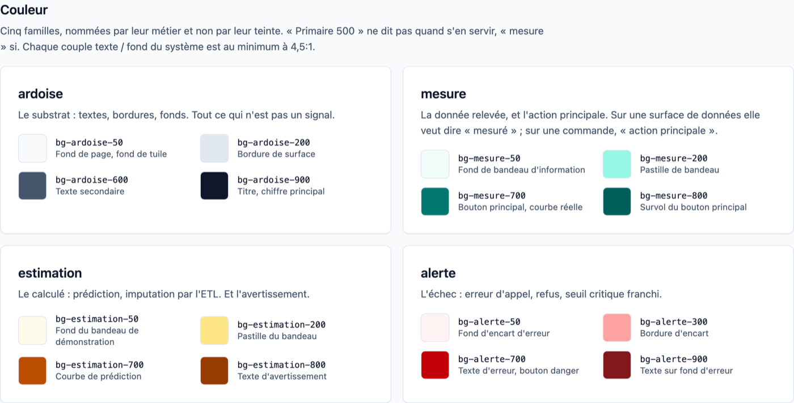
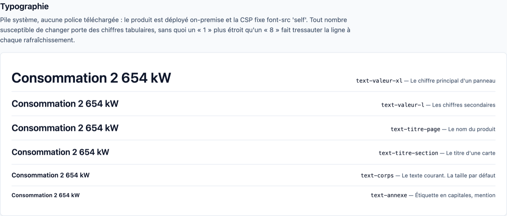
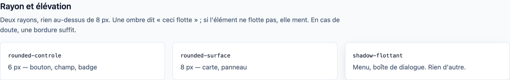
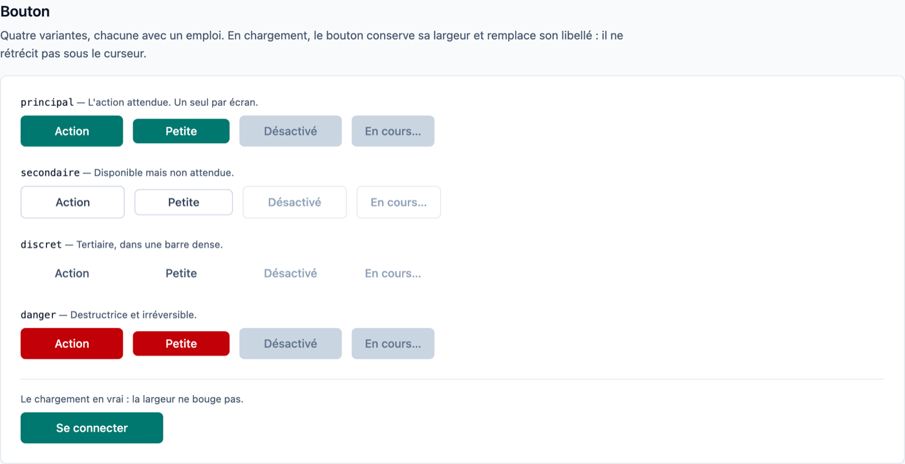
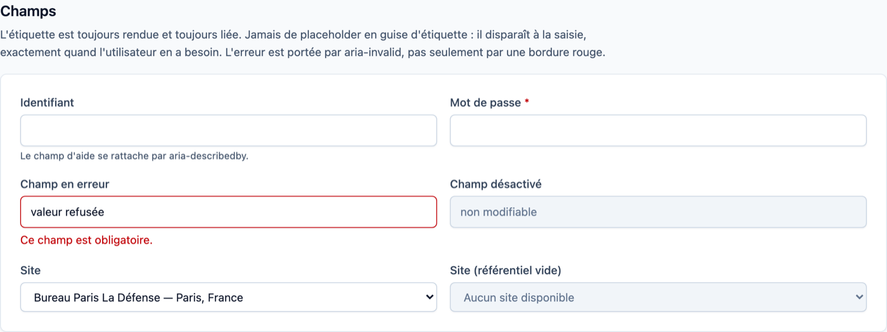
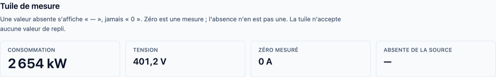
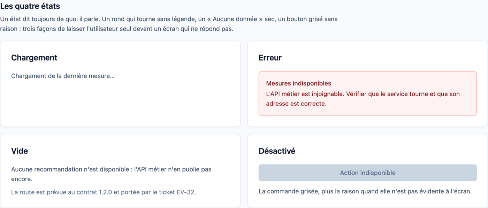
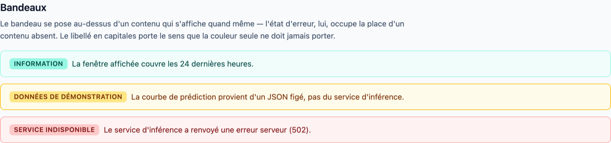
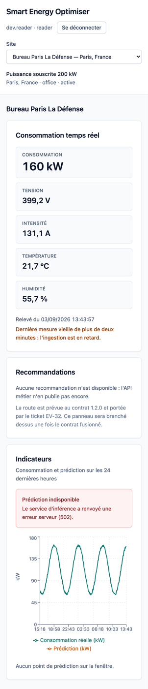
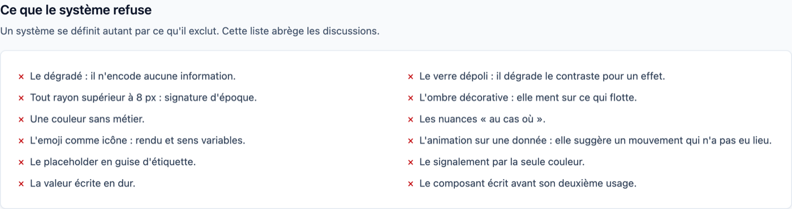

# Design system EnerVision

Référence d'usage du design system du dashboard (ticket **EV-47**).

La note de conception qui a précédé cette implémentation — intention, arbitrages,
points laissés ouverts — est dans `EnerVision-Design-System.docx`, repo
`enervision`, dossier `Architecture`. Ce document-ci ne redit pas le pourquoi :
il dit **où c'est installé** et **comment s'en servir**.

## Le principe, en une phrase

> Un écran de supervision affiche trois natures de valeur : ce qui a été
> **mesuré**, ce qui a été **calculé**, et ce qu'on **ignore**. Le système a une
> obligation : qu'on ne puisse jamais les confondre.

Tout le reste en découle. Une valeur `null` ne devient jamais un `0`. Une
prédiction ne prend jamais l'apparence d'une mesure. Un panneau vide dit
pourquoi il est vide.

## Voir le système

```bash
npm run dev
```

Puis <http://localhost:5173/design-system>.

La page **n'existe qu'en développement**. Sa route est déclarée sous
`import.meta.env.DEV`, que Vite remplace par une constante au build : en
production la branche est morte, le module n'est jamais référencé, et le bundle
ne le contient pas. Un test le vérifie (`src/routes/AppRoutes.test.tsx`), et on
peut le contrôler à la main :

```bash
npm run build && grep -rc "Ce que le système refuse" dist/ || echo "absente du bundle"
```

## Où c'est installé

| Chemin | Contenu |
| --- | --- |
| `src/index.css` | Les jetons, dans une directive `@theme`. **La source de vérité.** |
| `src/ui/` | Les composants et la lecture des jetons depuis JavaScript |
| `src/pages/DesignSystemPage.tsx` | La page de démonstration, développement seul |
| `docs/images/` | Les captures de ce document |

Il n'y a **pas** de fichier de configuration JavaScript : Tailwind v4 déclare
ses jetons en CSS. Ajouter une couleur, c'est ajouter une ligne dans `@theme`.

### Les jetons sont des alias

```css
@theme {
  --color-mesure-700: var(--color-teal-700);
}
```

Jamais des copies. Une montée de version de Tailwind qui réétalonne une échelle
nous suit alors sans intervention. C'est précisément l'inverse qui avait
produit le défaut que ce chantier corrige : le graphique portait `#0f766e` et
`#b45309` écrits en dur, les valeurs de **Tailwind v3**, alors que le projet est
en v4 où les mêmes noms valent `#00786f` et `#bb4d00`. La courbe de
consommation n'avait plus la couleur des commandes de la même famille, et rien
ne permettait de le voir.

## Couleur



Quatre familles, nommées par leur **métier** et non par leur teinte.

| Famille | Base | Quand s'en servir |
| --- | --- | --- |
| `ardoise` | slate | Le substrat : textes, bordures, fonds. Tout ce qui n'est pas un signal. |
| `mesure` | teal | La donnée relevée, et l'action principale. |
| `estimation` | amber | Le calculé : prédiction, imputation ETL. Et l'avertissement. |
| `alerte` | red | L'échec : erreur d'appel, refus, seuil critique franchi. |

`mesure` sert à la fois de couleur de donnée et de couleur d'action, à dessein :
sur une **surface de données** elle veut toujours dire « mesuré », sur une
**commande** toujours « action principale ». Aucune surface ne mélange les deux.

La famille `nominal` (vert) de la note de conception **n'est pas implémentée** :
le point D1 recommandait d'attendre un écran qui en ait besoin, le statut d'un
site s'affichant aujourd'hui en texte. Ajouter une couleur sans emploi
contredirait le système.

### Contrastes

Tous calculés, aucun estimé — conversion OKLCH vers sRGB puis ratio WCAG 2.1.
Le plus faible du système est à **4,76:1**, au-dessus du seuil AA de 4,5:1.

| Usage | Jeton | Sur | Ratio |
| --- | --- | --- | --- |
| Titre, chiffre principal | `ardoise-900` | blanc | 17,83:1 |
| Texte courant | `ardoise-700` | blanc | 10,36:1 |
| Texte secondaire | `ardoise-600` | blanc | 7,58:1 |
| Action, courbe mesurée | `mesure-700` | blanc | 5,36:1 |
| Courbe estimée | `estimation-700` | blanc | 5,03:1 |
| Texte d'erreur | `alerte-900` | `alerte-50` | 9,16:1 |

## Typographie



Pile système, **aucune police téléchargée**. Trois raisons, toutes propres au
projet : le produit est déployé on-premise et n'a pas à dépendre d'un CDN ; la
CSP posée en EV-48 fixe `font-src 'self'`, ce qui bloquerait une police tierce ;
et rien ne décale la mise en page au chargement.

| Jeton | Taille | Emploi |
| --- | --- | --- |
| `text-valeur-xl` | 30 px | Le chiffre principal d'un panneau |
| `text-valeur-l` | 20 px | Les chiffres secondaires |
| `text-titre-page` | 20 px | Le nom du produit |
| `text-titre-section` | 18 px | Le titre d'une carte |
| `text-corps` | 14 px | Le texte courant. Le défaut du produit |
| `text-annexe` | 12 px | Étiquette en capitales, mention |

L'échelle s'appelle `valeur` et non `mesure` comme dans la note de conception :
`mesure` est déjà une famille de couleur, et `text-mesure-700` à côté de
`text-mesure-xl` se lit mal.

### La règle des chiffres tabulaires

**Tout nombre susceptible de changer sans que l'utilisateur agisse** porte
`font-variant-numeric: tabular-nums`. Sans cela, un « 1 » plus étroit qu'un
« 8 » fait tressauter la ligne à chaque rafraîchissement, et sur un panneau qui
se rafraîchit toutes les trente secondes ce frémissement donne l'impression que
la valeur est instable alors qu'elle ne l'est pas.

La règle est posée dans `index.css` sur `time` et `[data-valeur]` : elle tient
donc même si quelqu'un oublie la classe.

## Rayon et élévation



| Jeton | Valeur | Emploi |
| --- | --- | --- |
| `rounded-controle` | 6 px | Bouton, champ, badge |
| `rounded-surface` | 8 px | Carte, panneau, encart |
| `shadow-surface` | discrète | Détacher une carte du fond |
| `shadow-flottant` | marquée | Menu ouvert, boîte de dialogue. Rien d'autre. |

Rien au-dessus de 8 px. Une ombre dit « ceci flotte » ; si l'élément ne flotte
pas, elle ment — une bordure `ardoise-200` suffit.

## Composants

Tous dans `src/ui/`. Importés directement, sans fichier baril : `import { Button }
from "../ui/Button"`.

### Button



```tsx
<Button onClick={enregistrer}>Enregistrer</Button>
<Button variant="secondaire" size="sm" onClick={signOut}>Se déconnecter</Button>
<Button type="submit" fullWidth isLoading={enCours} loadingLabel="Connexion en cours…">
  Se connecter
</Button>
```

| Prop | Défaut | Rôle |
| --- | --- | --- |
| `variant` | `principal` | `principal`, `secondaire`, `discret`, `danger` |
| `size` | `md` | `md` (36 px), `sm` (28 px, barres denses) |
| `isLoading` | `false` | Verrouille et remplace le libellé, sans changer la largeur |
| `loadingLabel` | `Chargement…` | Libellé affiché pendant l'attente |
| `fullWidth` | `false` | Largeur pleine |

**`className` n'est pas exposée.** Un composant de système qui accepte des
classes arbitraires finit par recevoir `bg-purple-500`. Si un besoin de mise en
page apparaît, il s'ajoute comme prop, délibérément.

**Un seul bouton `principal` par écran.** S'il en faut deux, c'est la hiérarchie
de l'écran qui n'a pas été tranchée.

### TextField et SelectField



```tsx
<TextField label="Identifiant" value={v} onChange={…} required error={erreur} />
<SelectField label="Site" options={sites} value={id} onChange={…}
             placeholder="Aucun site disponible" disabled />
```

L'étiquette est **toujours** rendue et liée par `htmlFor`. Jamais de placeholder
en guise d'étiquette : il disparaît à la saisie, exactement quand l'utilisateur
en a besoin. `placeholder` ici ne sert qu'à l'option de remplacement d'une liste
vide.

L'erreur est portée par `aria-invalid` et `aria-describedby`, pas seulement par
une bordure rouge. L'astérisque d'obligation est **hors** du `<label>` : dedans,
il entrerait dans son `textContent` et allongerait le libellé du champ.

### MetricTile



```tsx
<MetricTile label="Consommation" value={reading.consumption_kw}
            unit="kW" digits={0} emphasis="principal" />
<MetricTile label="Tension" value={reading.voltage_v} unit="V" />
```

Le composant **n'accepte aucune valeur de repli** : `null` entre, `—` sort. Un
zéro mesuré reste un `0` — c'est une mesure, pas une absence.

Sa valeur n'est volontairement **pas** dans un `<output>` : cet élément porte un
rôle ARIA `status` implicite, donc une région live. Cinq tuiles rafraîchies
toutes les trente secondes auraient annoncé cinq valeurs à chaque cycle, en
continu, à qui utilise un lecteur d'écran. Une valeur affichée n'est pas un
événement.

### Card et les quatre états



```tsx
<Card title="Consommation temps réel">
  {isLoading && <LoadingState>Chargement de la dernière mesure…</LoadingState>}
  {error !== null && <ErrorState title="Mesures indisponibles">{error}</ErrorState>}
  {vide && <EmptyState detail="Portée par EV-32.">Aucune recommandation.</EmptyState>}
</Card>
```

Une carte titrée rend une `<section>` reliée à son titre par `aria-labelledby` :
un lecteur d'écran annonce alors la région par son nom.

**Un état dit toujours de quoi il parle.** Un rond qui tourne sans légende, un
« Aucune donnée » sec, un bouton grisé sans raison sont trois façons de laisser
l'utilisateur seul devant un écran qui ne répond pas.

| État | Composant | Rôle ARIA |
| --- | --- | --- |
| Chargement | `LoadingState` | `status` — n'interrompt pas |
| Erreur | `ErrorState` | `alert` — interrompt |
| Vide | `EmptyState` | aucun |
| Désactivé | `disabled` sur la commande | — |

### Alert



```tsx
<Alert tone="avertissement" label="Données de démonstration">
  La courbe de prédiction provient d'un JSON figé.
</Alert>
```

L'`Alert` se pose **au-dessus d'un contenu qui s'affiche quand même** ;
l'`ErrorState`, lui, occupe la place d'un contenu absent. Le libellé en
capitales porte le sens que la couleur seule ne doit jamais porter.

## Le graphique

Recharts colore par propriétés SVG, pas par classes : il lui faut des valeurs.
Elles se lisent par `token()` de `src/ui/tokens.ts`, **jamais en dur**.

```tsx
import { token } from "../ui/tokens";
<Line stroke={token("mesure")} />
<Line stroke={token("estimation")} strokeDasharray="6 4" />
```

Le trait plein contre le trait discontinu n'est pas un ornement : c'est ce qui
rend la distinction mesuré / estimé perceptible par une personne daltonienne et
lisible sur une impression en noir et blanc.

## Responsive



Trois paliers, dessinés depuis le contenu et non depuis des largeurs d'appareil :

| Palier | Grille du dashboard | Tuiles secondaires |
| --- | --- | --- |
| < 640 px | une colonne | une colonne |
| ≥ 640 px (`sm`) | une colonne | deux colonnes |
| ≥ 768 px (`md`) | deux colonnes, graphique pleine largeur | deux colonnes |
| ≥ 1024 px (`lg`) | les trois zones de la maquette | deux colonnes |

Le graphique reçoit la moitié de la grille sur grand écran : c'est lui qui a
besoin de place.

## Accessibilité

| Règle | Comment le système la tient |
| --- | --- |
| Contraste AA minimum | Chaque couple est calculé. Le plus faible : 4,76:1 |
| La couleur n'est jamais seule | Trait plein / discontinu, libellé de bandeau, titre d'erreur |
| Focus toujours visible | Anneau `mesure-700` posé globalement sur `:focus-visible` |
| Cible de pointage | 36 px minimum, 28 px en barre dense |
| Le mouvement se coupe | `prefers-reduced-motion` réduit les durées à zéro |
| États annoncés | `role="status"` au chargement, `role="alert"` à l'erreur |

## Ce que le système refuse



Un système se définit autant par ce qu'il exclut. Cette liste abrège les
discussions : le dégradé, le verre dépoli, tout rayon supérieur à 8 px, l'ombre
décorative, une couleur sans métier, les nuances « au cas où », l'emoji comme
icône, l'animation sur une donnée, le placeholder en guise d'étiquette, le
signalement par la seule couleur, la valeur écrite en dur, et le composant écrit
avant son deuxième usage.

## Faire évoluer le système

**La règle du deuxième usage.** On n'extrait pas un composant à son premier
emploi. Un composant écrit pour un seul écran encode les besoins de cet écran et
devient un obstacle au deuxième. On duplique une fois, on observe ce qui est
réellement commun, puis on extrait.

Pour ajouter un jeton : une ligne dans `@theme` de `src/index.css`, et
l'utilitaire Tailwind correspondant est généré. Pour ajouter une couleur : dire
d'abord à quelle question de métier elle répond.

Les tests des composants portent sur le **comportement et les rôles
d'accessibilité**, jamais sur les classes CSS. Ils survivent donc à une reprise
de style, ce qu'on attend d'eux.
